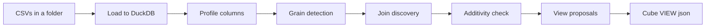

# Schema Discovery — Auto-inferring Cube Views from Raw Data

_Design note · status: proposal (v1 not yet built)_

## Goal & scope

Let a user point at raw CSVs and have an agent propose the relationships needed to build a Cube view, instead of hand-authoring `CUBE_CONFIGS`/`VIEW_CONFIGS` in `seed.py`. DuckDB is the analysis sandbox; the deliverable is a reviewable view definition.

**v1 boundary:**

- In scope: ingest CSVs from a folder, profile them, detect grain, discover joins, classify additivity, propose views.
- Output is a **draft config** the user reviews — nothing is auto-committed to Cube, and the live Cube→Postgres runtime is untouched.
- The chain runs: profile → grain → joins → additivity → view proposals → Cube `VIEW` json.

**Non-goals (v1):** measures/dimensions authoring beyond what additivity implies, composite foreign keys, loading data into Postgres, wiring to the running agent.

## Pipeline overview

Deterministic statistics find the structure; the LLM interprets, names, and disambiguates; the human decides.



- **DuckDB (deterministic):** profiling, unique-key search, containment, fan-out, result-grain — all the numbers.
- **LLM (judgment):** break ties between candidate joins, fuzzy-match messy names, name joins/views, write descriptions, explain each proposal for review.
- **Human:** accept / rename / reject; the agent never auto-commits an inferred join.

## Ingestion & profiling

User gives a folder path; the tool lists the CSVs found and the user picks which to import. Each file loads into DuckDB via `read_csv_auto` and is cached to a `.duckdb` file so re-runs skip parsing (the load is the single most expensive step, not the analysis).

One scan per table produces the **Stage-0 profile**, the input everything downstream reads:

| Field | How | Used for |
| --- | --- | --- |
| type | DuckDB inference | join type-compatibility |
| ndv (distinct) | `approx_count_distinct` (HLL) | keys, direction, pruning |
| min / max | aggregate | range-overlap pruning |
| nulls | aggregate | key validity |
| samples | a handful of values | LLM disambiguation |

The profile is tiny and **independent of row count**, so it caps LLM token cost regardless of table size.

## Grain detection

Each table's grain (its true unique key) is load-bearing: it sets join direction, powers the fan-out check, and classifies facts vs dimensions vs bridges. It runs before join direction and shares the Stage-0 profile.

**Single-column grain is free** — any column with `unique_ratio ≈ 1.0` is a candidate key (usually the surrogate `id`).

**Composite grain** (no single unique column, e.g. `order_items` keyed by `(order_id, product_id)`) uses a level-wise Apriori unique-column-combination search:

1. Test singletons; a unique one wins, stop.
2. Else pairs — but pruned first, not all `C(n,2)`.
3. A triple is tried only if all its pairs survived non-unique (Apriori generation).
4. Cap at k=3 → no key found means grain `undetermined, needs human`.

**Pruning** (from free stats, no data scan): drop constants; skip combos where `∏ ndv < rows` (can't be unique); drop FD-redundant pairs (`ndv(a)=ndv(a,b)` means `a→b`).

**NULL trap:** test uniqueness over non-null tuples only — `UNIQUE` counts NULLs as distinct, so a NULL-riddled combo can look like a false key.

**Stop early:** grain needs only *one* minimal key. Prefer fewest columns, no nulls, and — if the key is all foreign keys — that flags a **bridge table**.

The blow-up is in column count and key size, not rows; 10 tables = 10 independent parallel searches.

## Join discovery

A funnel: cheap pruning kills ~99% of column pairs before any data comparison; exact checks run only on survivors.

1. **Candidate generation** — keep pairs with compatible type + a name signal. The name signal is **specificity-weighted (IDF-style)**: `customer_id`↔`customers.id` is strong; a generic `status` shared across 8 tables carries almost no signal.
2. **Metadata pruning** (arithmetic on stats, no scan): drop disjoint min/max ranges; drop where `ndv(FK) > ndv(PK)` (containment impossible); a PK candidate must be near-unique.
3. **Exact containment** on survivors — fraction of the FK's non-null values present in the PK. ~1.0 = strong FK.
4. **Direction** falls out of uniqueness: the unique side is the "one", giving `many_to_one` for free.

Name similarity is a **prior, not proof**: not sufficient (matching names can be coincidental — `quantity ⊆ id`) and not necessary (real FKs break naming, e.g. `custno → customers.id`). Containment is the verdict; names rank and disambiguate.

## Fan-out, grain & additivity

A join fans out when the declared "one" side isn't actually unique on the key; each matched row multiplies and any measure summed over it over-counts. Under Cube's LEFT joins, orphans don't cancel it — fan-out is a pure over-count.

**The "truth" is not an external ground truth.** A measure has a definitionally-correct value at its native grain — `SUM(total_amount) FROM orders` means "sum once per order". The real invariant is: *does the join keep exactly one output row per fact row?* That's structural, checkable from data alone.

**Below its grain a measure isn't over-counted — it's undefined.** Joining `orders → order_items` descends to line grain, where `total_amount` is repeated; the valid additive column there is a different one (`quantity`, `quantity × unit_price`). So comparing the same column's SUM across a grain-changing join is a category error.

**Measure the result grain empirically**, with a synthetic row id per base table (so no key is assumed — which matters when grain is composite):

```sql
SELECT COUNT(*) AS join_rows,
       COUNT(DISTINCT oi._rid)  AS oi_present,   -- ratio 1.0 -> at grain
       COUNT(DISTINCT ord._rid) AS ord_present   -- ratio >1  -> repeated
FROM <join>;
```

`join_rows / <T>_present` is table T's fan-out factor. Then classify every column:

| column's home grain vs result grain | verdict |
| --- | --- |
| same | additive measure |
| coarser (repeated) | dimension / label only — SUM invalid |
| different fact grain | fan / chasm trap — separate query or view |

## Join-path ambiguity & bridges

At ~10 tables the accepted edges form a graph, but a Cube view is a **tree rooted at one base**. Wherever more than one path connects two tables, a human must choose. Four shapes:

- **Multi-edge** — two keys between the same tables (`customer_id` and `billing_customer_id`).
- **Diamond** — two paths through different intermediaries.
- **Cycle** — the graph loops; a view's tree must drop an edge.
- **Transitive redundancy** — a direct `A→C` plus an `A→B→C`.

This is a correctness problem, not cosmetic: different paths fan out differently. The path-review step composes the per-hop fan-out along each path and flags any that inflate. Default = shortest path with fan-out ×1.0.

**Bridges resolve many-to-many.** A table whose composite grain is two foreign keys is a junction; `products ↔ orders` (both sides have duplicate keys) resolves to `products → order_items → orders`. Grain detection discovers the bridge rather than just flagging that one is needed.

**Ambiguity is often the view boundary.** Two facts that can't connect without fan-out shouldn't be merged — the tool proposes two views and flags "don't mix."

## Review / edit UX

Same shape as the existing config-edit flow: the agent proposes → **LangGraph interrupt** → UI renders a review surface → the user triages → resume with decisions. One addition: a **`/test-join`** endpoint that hits DuckDB (mirroring `/test-sql` against Postgres) so edits re-validate live without a full agent round-trip.

Proposals arrive in three buckets:

- **Accepted** — join in Cube shape + reasoning + evidence (containment, orphans, uniqueness).
- **Uncertain** — multi-join-to-same-cube, self-joins, missing conventions; needs a name/decision.
- **Rejected** — stats-pass-but-semantically-wrong (e.g. `quantity ⊆ id`), with the overridden confidence.

Per-card edit exposes the four things that can be wrong: FK column, PK table+column, relationship type, and alias. Every edit re-runs `/test-join`, which recomputes containment and the **fan-out guard** against real rows — e.g. "`customers.id` is not unique for this join; SUM would inflate ~1.7× (12,043 → 20,110 rows)."

Nothing is auto-committed — a wrong join silently returns wrong numbers, so human confirm is mandatory. "Export draft" then produces the config artifact, the accepted graph, and a decision log.

## View proposals → Cube VIEW config

Views fall out of grain: **one fact grain = one view**; dimensions attach via `many_to_one`; additive measures come only from the base grain. A second fact grain gets its own view, never merged — this derives the existing `sales` / `product_sales` split instead of hand-deciding it. Bridge tables disappear into join paths, not surfaced as views.

The emitted shape matches `VIEW_CONFIGS`:

```json
{
  "name": "sales",
  "data": {
    "name": "sales",
    "public": true,
    "cubes": [
      { "join_path": "orders",
        "includes": ["total_revenue", "order_count", "status", "country"] },
      { "join_path": "orders.customers",
        "includes": ["name", "segment"], "prefix": true }
    ]
  }
}
```

- `join_path` = the grain-preserving path from the base (`orders` → `orders.customers`).
- `includes` = the members that passed the additivity check per table.
- Base cubes stay `public: false`; the view is the only public surface.

Flow to live Cube (a later step, out of v1 scope): `seed.py --update` → `reload_cube_schema`. The existing `build_utils.js` already handles the `join_path`-as-function and interpolating-`sql` gotchas; the tool only emits this json.

## Scale & performance

At 10 tables × ~1M rows, **row count is not the bottleneck** — DuckDB handles that trivially (a containment anti-join over 1M rows is sub-second). The blow-up is the number of pairwise checks: ~45 table-pairs × ~20 columns ≈ 18,000 naive containment checks.

The funnel controls it: metadata pruning (type, range, cardinality) kills ~99% of pairs on precomputed stats alone, leaving single-digit-to-dozens of real candidates, where exact checks are affordable.

Cost profile:

| Step | Cost at 10×1M |
| --- | --- |
| CSV load → DuckDB | dominant; cache to `.duckdb` |
| Stage-0 profile | one scan/table, seconds, parallel |
| Metadata pruning | ~free (arithmetic on stats) |
| Exact checks | dozens × sub-second |
| LLM payload | flat — independent of row count |

Key moves: cache the loaded data; build each PK column's distinct set once and reuse across FKs; in the composite-key search, one DuckDB scan per level computes all candidates' distinct counts via batched `approx_count_distinct`. Table count only multiplies independent parallel work; the one thing that genuinely gets harder is join-path *ambiguity*, which is a review-UX problem, not a performance one.

## Open questions & next

- **Measures/dimensions pass** — v1 stops at joins + additivity classification. The next pass is where the LLM is essential: classify columns into measure types, write descriptions + synonyms, and label the ambiguous paths.
- **Composite foreign keys** — deferred for join *matching*, but composite grain is in scope (needed for the fan-out check and bridge detection). Watch for the case where a join genuinely needs a composite FK.
- **Runtime wiring** — not yet connected to live Cube; output is a draft artifact. Loading CSVs into Postgres vs a second DuckDB Cube source is a later decision.
- **Ambiguity review UX** — how competing paths are presented and picked, and how a chosen path emits into the view draft.
- **Grain `undetermined`** — wide low-cardinality tables that hit the k=3 cap need a clean hand-off path in the review UI.
